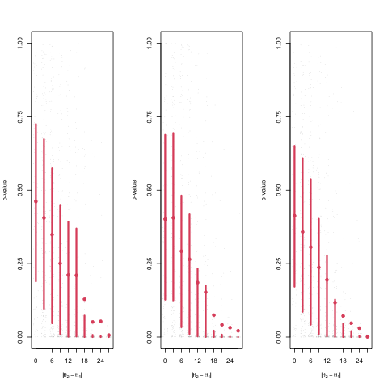
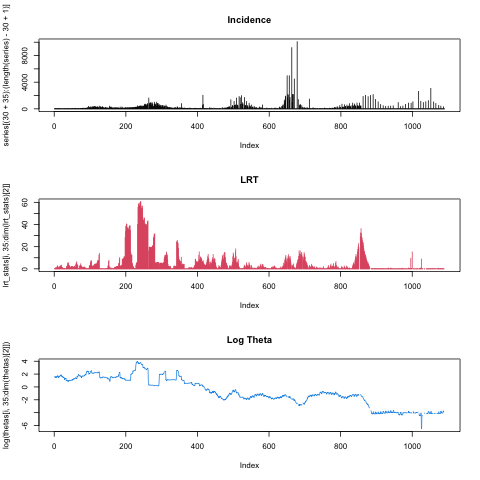
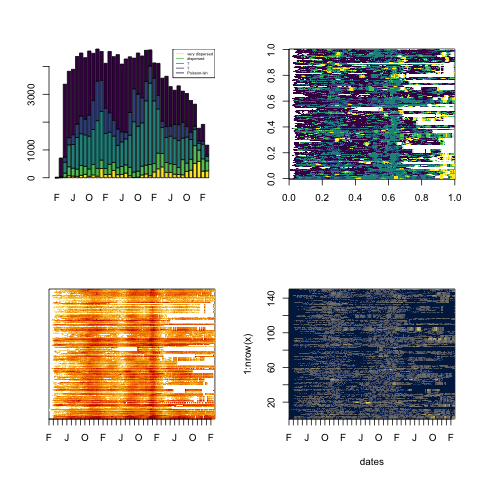

# Detecting changes in dispersion in COVID-19 incidence time series using a negative binomial model

## Introduction 

Time series of observed infectious disease incidence are, to varying degrees, "noisy", showing higher frequency oscillations around trends at broader temporal scales. Highly variable incidence that characterizes noisy data arise from imperfect and variable reporting (i.e, 'measurement error'), but also suggests transmission heterogeneity (superspreading), demographic/environmental heterogeneity, or changes in population effective reproduction number (R). Therefore, variability can contain information important to understanding epidemic dynamics and societal responses. Yet metrics of variability are often overlooked ways to understand these dynamics, and techniques based on variability in epidemic time series are still emerging. One area of interest is how variability is related to different phases of an epidemic. For instance, Graham et al. (2019) use the mean and interannual coefficient of variation of measles incidence to construct a metric indicative of where a location may be on the path to elimination of the pathogen. Similarly, it was recently found that $k_t$, the time-varying transmission heterogeneity for COVID-19, decreased over time and was significantly associated with interventions to slow spread in Hong Kong (Adam et al. 2022). Variability in *population-level* incidence time series may therefore provide information about what phase or dynamic regime an epidemic is in, as well as potentially indicating the level of heterogeneity at finer spatial and temporal scales, in transmission, susceptibility, and/or reporting (this is essentially the same list as second sentence except with reporting instead of environmental/demographic stochasticity). Analyzing variability in terms of bursts of incidence is also important for planning surge capacity (Wallinga 2018). Sun et al. (2021) found a combination of individual-based and population-based strategies was required for SARS-CoV-2 control, further highlighting the importance of considering population-level variability and its relationship to individual-level variability. 

Dispersion around a rolling mean (moving window) of an incidence time series may contain information about the size and frequency of local outbreaks. From the perspective of an infectious individual, incidence experienced in their local spatial-temporal neighborhood will be higher than the global mean when dispersion is high. A 'mean crowding' parameter was proposed, which is the mean number per individual of other individuals in the same quadrat (Lloyd 1967). This is a useful way to think about dispersion in case count time series, as (absent other processes that influence dispersion such as variation in reporting) one can think of degree of dispersion as degree of clustering/crowding of cases, which is related to concepts like transmission heterogeneity. Specifically, individual-level heterogeneity in transmission scales up to affect population-level dynamics (Lloyd-Smith 2005), so dispersion in epidemic trajectories at the population level may provide information about individual-level variability in the transmission process. Individual-level variability in transmission is most often studied using contact-tracing data. However, contact tracing data requires intense investment of resources (Kretzschmar et al. 2020), so analysis of incidence data may often be more feasible.

One of the reasons why studying variability in incidence time series is not more widely done is because it is difficult to disentangle the effects of population size/incidence on variance. For instance, if we model a process as Poisson, we assume that if the mean of the process is large, the variance will be large as well. Since mean case counts is directly related to population size/incidence, we would infer that variance in case counts is large in large population/incidence settings. In addition to the mean, it was found that demographic stochasticity of measles becomes more important in small human populations, where dynamics can’t be described as well simply by contact rate and birth rate (Grenfell et al. 2002). So, population size may again be a confounder. Furthermore, the rate of the case-count-generating process is often changing in an epidemic, which cannot be accomodated by a Poisson model. The negative binomial distribution may accurately model a time series if there is a changing process mean: for example, if the mean of a Poisson distribution itself follows a gamma distribution, the resulting distribution is negative binomial (Cook 2009). The result is that we should use the dispersion parameter of a negative binomial distribution to measure changes in meaningful variability in settings with differing base population/incidence, not the variance of a Poisson model.

We develop a method that quantifies the evolution of dispersion along incidence time series, allowing for the detection of changes in variability that are not due to changes in population size or overall burden of incidence. We apply the method to COVID-19 incidence data in US counties to investigate the relationships between incidence, dispersion and epidemic dynamic regimes over a portion of the pandemic. [consider whether we want to telegraph more specific results / relationships from covid analysis]

## Results

1. The negative binomial method is robust to changes in population size (for analytical derivation see Supplement X).

  

Figure 1. Detecting dispersion changes in incidence time series in populations of different sizes. A) Simulated incidence when dispersion is constant and B) when dispersion changes during the epidemic. C) Daily COVID-19 cases in Jefferson County, AL and associated (log) dispersion estimates. D) Shows the performance of the method with simulated data that has different absolute differences in theta (horizontal axis of each pane) across different population sizes (each panes is one population size). O and X mark the null and alternate hypotheses indicated in panels A and B. 

  

Figure 2. COVID-19 incidence, likelihood ratio test statistic values, and the dispersion parameter values for Jefferson County, AL between 2020-03-25 and 2023-03-19. Values of the likelihood ratio test statistic, and the dispersion parameter were computed on by fitting the negative binomial model and conducting likelihood ratio tests about dispersion on a rolling basis.  

3. Highly overdispersed incidence patterns occurring more frequently later in time series, consistent with more heterogeneity in transmission, susceptibility and reporting
4. Increases in dispersion around the holiday periods in the dataset; concurrent with increases in incidence.
5. Evidence for a change in theta observed across many counties (evidenced by concentration of low p-values concurrent with peak incidence).

  

Figure 4.  Evolution of dispersion between 2020-02-20 and 2023-03-19 in large counties in the US.b) log theta. a) Binned log of the dispersion parameter over time; b) Log of the dispersion parameter over time as well as for each of the large counties (y-axis); c) Log incidence (new cases per individual) over time as well as for each of the large counties (y-axis); d) LRT p-values over time as well as for each of the large counties (y-axis).

What makes a change in dispersion meaningful is how it affects variance and variance-mean relationships. For instance, if dispersion is high in a high incidence setting, the variance-mean ratio would be larger than for the same dispersion in a smaller incidence setting. A change from $\theta = 1000$ to $\theta = 100$ is operationally significant for large populations during times of peak incidence due this variance-mean scaling. So, a small increase in dispersion could have large impacts on the variance in large populations at times of peak incidence. Raising variance relative to mean implies spatiotemporal "crowding" of cases (i.e. localized surges) which may necessitate more surge capacity in hospitals and testing centers. Additionally, it may indicate less diffuse epidemics that are potentially more subject to climate forcing (Dalziel et al. 2018), or increased locally experienced mean density (Lloyd 1967). From the data, we observe a drop from $\theta$ = 2.707735e+16 to $\theta = 21.8711$, which, conditional on the observed case count of 3$$, would lead to an increase in variance from around 3 to around 3.4. In contrast, if the observed case count were 300, variance would go from around 300 to around 4415.019.
$$var = \mu + \mu^2/\theta$$

## Materials and Methods

"Classical theory" (May and others host-parasitoid models then Grenfell et al.) (cite) says:
$$I_{t+1} = NB(\mu = R_t I_t, \theta_t = I_t)$$

where $R_t I_t$ is the expected value and the dispersion parameter is equal to I_t.

Other processes besides the current number infected might dispersion so we should look at changes in $\theta_t$ to understand important processes that may leave a signal in dispersion. Specifically estimate theta over time, and also scan for changepoints. 

The general framework is that incidence is drawn from a negative binomial distribution with time-varying mean and dispersion parameters.

$$f_t(I) = {I + \theta - 1 \choose I} \frac{\mu}{\mu+\theta}^I \frac{\theta}{\mu +\theta}^\theta$$

$$E(I) = \mu$$

$$Var(I) = \mu + \frac{\mu^2}{\theta}$$

where $\mu_t$ represents the time-varying mean incidence and $theta_t$ the dispersion parameter. We estimate $\mu_t$ and $\theta$ using iterative reweighted least-squares (citation lrt) with a moving window approach (see Supplemental X). For each window, $\mu_t$ is estimated using a spline function in time, and a single value of $\theta$ is estimated for the window. 
By moving the window one time step at a time, a time series for $\theta_t$ can be produced. While population size influences mean and variance in count data, and thus could have an impact on estimates of dispersion, we robustly adjust for that by using population size an offset in the model (see Supplemental X).

Sources for methods:

The negative binomial distribution might accurately model a time series if there is a changing process mean: for example, if the mean of a Poisson distribution itself follows a gamma distribution, the resulting distribution is negative binomial (Cook 2009).

Negative binomial regression (in contrast to Poisson regression) can account for unobserved heterogeneity, time dependence in the rate of a process and contagion that all lead to overdispersion (Barron 1992).

A recently proposed negative binomial regression model for time series of counts also accommodates serial dependence (Davis and Wu 2009).

Natural splines are cubic splines which are linear outside of the boundary knots (Perperoglou et al. 2019).

 Therefore, to evaluate whether the negative binomial conditional distribution is needed (opposed to a Poisson/quasi-Poisson conditional distribution with the same model of process mean), inspection of mean-variance relationships using a diagnostic plot is possible (Ver Hoef and Boveng 2007)
 
 This procedure is implemented via the NBPSeq R package (https://CRAN.R-project.org/package=NBPSeq) and from Di et al. (2011). 

 From a modern theoretical ecology perspective, investigating beyond the first moment of a process has also been identified as important: ecological experiments are typically geared towards assessing the impacts of the mean strength of causal processes, however the variance about mean effects have been mostly ignored as a driver in biological assemblages, but may be as important as the mean (Benedetti-Cecchi 2003).

### Introduce the method

Challenge has been "spurious correlation" with population size.
Leads into talking about model w offset.

1. Our method identifies shifts in population-level dispersion in incidence

2. NB regression can account for unobserved heterogeneity, time dependence in the rate of a process/contagion that all lead to overdispersion (Barron 1992)

3. We examined dispersion statistics, and diagnostic plots(s) to make sure we needed to account for overdispersion

3. The model components and why we include them:
  a) Linear predictor includes a natural spline (3 df) in time to account for autocorrelation in case counts
  b) Offset term in order to directly model counts (here, COVID-19 cases) per unit of observation (here, per individual)
  
  $$log(E[Y_i]/n_i) = \beta_1h_1(t_i) + \beta_2h_2(t_i) + \beta_3h_3(t_i)$$
  
  $$log(E[Y_i])-log(n_i) = \beta_1h_1(t_i) + \beta_2h_2(t_i) + \beta_3h_3(t_i)$$
  
  $$log(E[Y_i]) = \beta_1(h_1(t_i) + \beta_2h_2(t_i) + \beta_3h_3(t_i) + log(n_i)$$

4. IRLS to get parameter estimates of the model

### Application of the method to simulated data

1. Validity/power simulations: used Gaussian and uniform epidemic curves

2. Also simulated data assuming that theta was a function of the mean of the process in order to assess the robustness of the test (Supplement)

3. Include tabulated Type I error rate and power as well as p-value plot?

### Scanning for breakpoints 

1. LRT statistic doesn't necessarily track with changes in mean incidence in a county, but rather captures dispersion changes

2. Investigated large counties (top 4% in each state)

2. Theta and p-value surfaces indicate that cases fluctuated more around a time-averaged county trajectory during N-F 

## Discussion

Deep thought: Consider the relationship between dispersion in a moving window sense like we are here, and autocorrelation. Note that some kinds of time dependence in the rate can cause autocorrelation, as can contagion (if it occurs outside of set periods), and heterogeneity (if an omitted variable is correlated in time) (Barron 1992). Also, demographic structure (e.g., age structure) has the potential to affect temporal autocorrelation in transmission rate - the effects of age structure can be captured by a model that includes an infection rate that varies over time (Earn et al. 1998). 

Deep thought: does a big city with more hospitals, effecitively dividing up into a collection of small towns?, experience a benefit of better (reduced) variance-mean relationships? especially during periods of peak incidence?

The results imply that we can revise our understanding of case count dispersion: dispersion is high at unexpected times (peak incidence) and corresponds to significant increases in variance when incidence is high.

## Supplement

1. Simulations reveal method is robust to population size
[sim_pval_v_pop.pdf] 

Abstract:
Metrics of variability are often overlooked and useful ways to understand epidemic dynamics. For instance, superspreading of viruses such as SARS-CoV-2 can be elucidated by utilizing such metrics. Our method identifies shifts in population-level incidence dispersion, allowing a more complete and predictive understanding at both the individual and population level, and allowing practitioners to prepare surge capacity in certain months. Although classical theory predicts that there will be less dispersion when incidence is higher,"We develop a flexible way of estimating how variability changes over time, including detecting breakpoints representing discrete shifts in variability." And it factors out population size and case numbers. Able to detect changes in variability that matter, and distinguish them from changes due to simple statistical effects of population size or case number.
 We investigate changes in dispersion over time and space and find that there are increases in dispersion around holiday periods in many US counties, concurrent with observed incidence increases. In addition, highly overdispersed patterns occur more frequently later in time series, consistent with more heterogeneity in transmission, susceptibility, and reporting. Our method is robust to changes in incidence and to population size, allowing for quantification of dispersion—indicative of superspreading dynamics—without artifactual contributions from these features.

